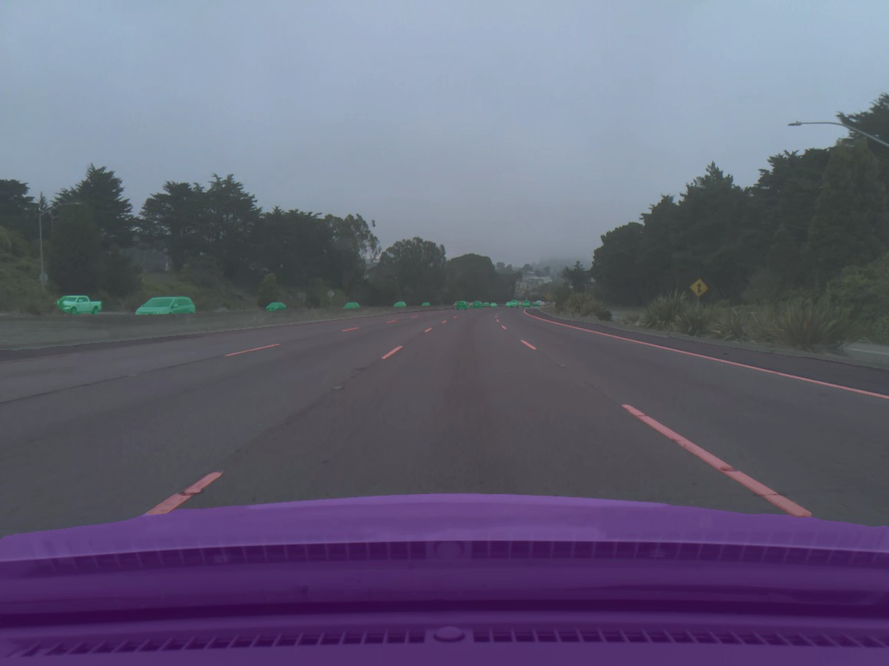
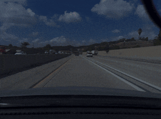

# comma10k

<!-- If you need to change this because the cells have shifted or a new spreadsheet is used, go to https://cellshield.info -->

It's 10,000 PNGs of real driving captured from the comma fleet. It's MIT license, no academic only restrictions or anything.

Learn more from [the blog post](https://blog.comma.ai/crowdsourced-segnet-you-can-help/), or on the [comma.ai discord](http://discord.comma.ai) in the #comma-pencil channel.

Run <pre>./viewer.py</pre> to see them with the mask overlay.

## Directories

<pre>
 imgs/  -- The PNG image files
 masks/ -- PNG segmentation masks (update these!)
 imgs2/  -- New PNG image files paired with fisheye PNGs
 masks2/ -- PNG segmentation masks (update these!)
 imgsd/  -- Driver camera PNG image files from Comma3
 masksd/ -- PNG segmentation masks (update these!)
 segs/  -- The outputs in probability from our internal segnet (unreleased, too big)
</pre>

## Categories of internal segnet

<pre>
 1 - #402020 - road (all parts, anywhere nobody would look at you funny for driving)
 2 - #ff0000 - lane markings (don't include non lane markings like turn arrows and crosswalks)
 3 - #808060 - undrivable
 4 - #00ff66 - movable (vehicles and people/animals)
 5 - #cc00ff - my car (and anything inside it, including wires, mounts, etc. No reflections)
 6 - #00ccff - movable in my car (people inside the car, imgsd only)
</pre>

## How can I help?

1. Visit the [Google Spreadsheet](https://docs.google.com/spreadsheets/d/1ZKqku0cAyWY0ELY5L2qsKYYYA2AMGbgAn4p53uoT3v8/edit#gid=484622533) (request access to edit the spreadsheet) and put your discord username in the "labeler" column for the mask(s) you'll be working on and change the status to "In Progress." If you're new, please start off with just one so we can leave you feedback; this is to prevent you from having to redo them because of something done incorrectly. **UPDATE**: The original imgs set is complete, but a new imgs2 set was added and is still unfinished. There are "e" and "f" versions for the same image number. Check the "imgs2 series" tab in the spreadsheet to see what's available. 

     **UPDATE 2**:  Interior images have been added to the imgsd folder. These are the current priority. Instead of starting from scratch, you can start with [these incomplete masks with mycar mostly done.](https://spektor56.github.io/comma10kreviewer/?index=0&pr=2947) Just click on open editor to have them open in imglabeler.
   
2. Spend some time studying already merged masks to see how things are labeled. You could use the comma10kviewer web tool to easily do this. 
3. Watch the Beginner Tutorial youtube video below.
4. Start labelling! Useful label tools:
   * [img-labeler](https://spektor56.github.io/img-labeler/) (Only compatible with Chrome and Edge. Other browsers like Brave, Firefox, and Opera, even if chromium based, don't work properly. Must also be used with browser zoom and monitor scaling disabled otherwise it will save with a wrong resolution).
   **UPDATE**: Img-labeler has been updated to support the new imgs2 set. If, for example, you would like to work on image 00074_e, simply type 74e in the image number box.  Type 74f for image 00074_f.

   * An external image manipulation tool such as [GIMP](https://www.gimp.org/downloads/)/[Krita](https://krita.org/) (Free) or [Adobe Photoshop](https://www.adobe.com/products/photoshop.html) (Paid)
If you choose to use an external tool please ensure your color mode is set to 8-bit, and that antialiasing doesn't change the colors on the edges of your mask.

5. Fork this repository to your account using the "Fork" button in the top right
6. Create a **new branch** from the **master** branch, and use your labelling tool of choice to label some images
7. Open a pull request from your new branch to the master branch in the official repository to submit your changes!
8. Visit the #comma-pencil channel on the [comma.ai Discord](http://discord.comma.ai) for the latest news and chat about the project.

## Image Viewing Tools

1. [comma10kviewer](https://spektor56.github.io/comma10kviewer)
2. [comma10kreviewer](https://spektor56.github.io/comma10kreviewer)

### Beginner Tutorial

## The Goal

## Publication

comma10k is still a work in progress. For now, just cite the GitHub link. Once we reach 10k images, we'll release a paper, a train/test split, and a benchmark model. 

For now, we are validating on images ending with "9.png" and are seeing a categorical cross entropy loss of 0.051. Can you beat this?

And it has been beaten with a CCE loss of 0.045, <a href="https://github.com/YassineYousfi/comma10k-baseline">"comma10k-baseline" by YassineYousfi!</a>

Can you beat that?

